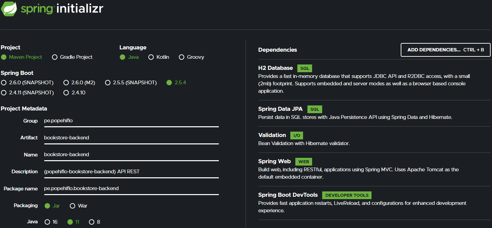

#  BookStore : Fullstack application 📚
**Proyecto Web Fullstack**   
`H2`, `JPA`, `Hibernate`, `Spring Boot`, `TypeScript`, `Angular`.  
## Repositorio del backend [bookstore-backend](https://github.com/popehiflo/bookstore-backend) 👈
## Repositorio del frontend [bookstore-frontend](https://github.com/popehiflo/bookstore-frontend)

## Backend Java construido con 🛠️
* [H2]() - Sistema administrador de BDs relacionales hecho con Java para entornos dev
* [Java 11](https://www.oracle.com/java/technologies/downloads/#java11) - Java SE Development Kit 11
* [Spring Boot](https://spring.io/) - Convencion sobre configuración
* [Maven](https://maven.apache.org/) - Manejador de dependencias   

## Codigo Fuente 📁
* [Backend Spring Boot - API REST](bookstore-backend)  
## Dependencias - estructura basica

 

   

## Licencia 📄
¿Qué es eso? 😆     

         
⌨️ con ❤️ por [popehiflo](https://github.com/popehiflo) 😊